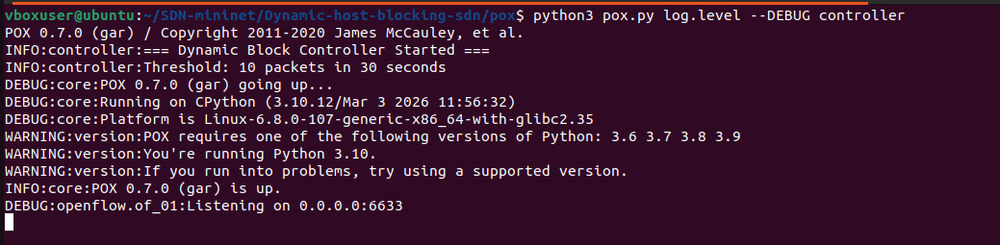
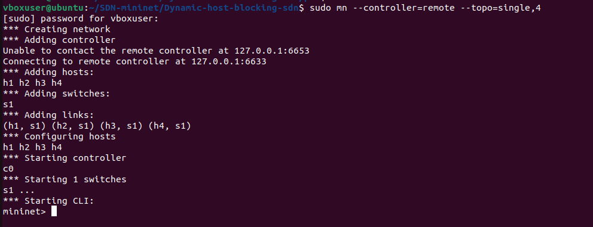
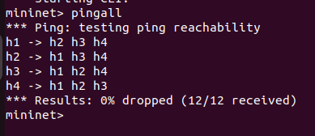
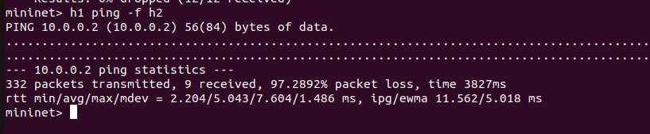
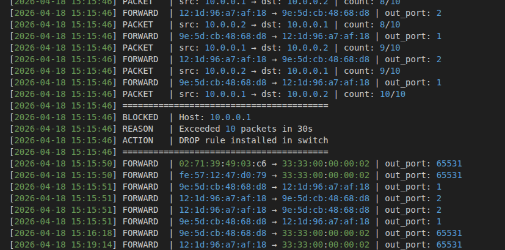
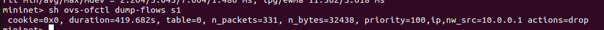

# Dynamic Host Blocking System using SDN (Mininet + POX)

## Problem Statement
In traditional networks, blocking a misbehaving host requires manual intervention on each network device. This project implements an SDN-based Dynamic Host Blocking System that automatically detects suspicious traffic behavior and dynamically installs blocking rules on the switch without any manual intervention.

Suspicious activity is defined as a host sending more than 10 packets within a 30-second window, simulating behavior like a port scan or flood attack.

---

## Project Overview

| Item | Details |
|------|---------|
| Controller | POX 0.7.0 |
| Simulation | Mininet |
| Protocol | OpenFlow 1.0 |
| Topology | Single switch, 4 hosts |
| Blocking Trigger | 10 packets in 30 seconds |

---

## Topology

```
h1 (10.0.0.1) ──┐
h2 (10.0.0.2) ──┤
                 s1 ──── POX Controller (port 6633)
h3 (10.0.0.3) ──┤
h4 (10.0.0.4) ──┘
```

---

## How It Works

1. Mininet creates a virtual network with 1 switch and 4 hosts
2. POX controller connects to the switch via OpenFlow
3. Every packet is sent to the controller via packet_in events
4. Controller counts packets per source IP within a time window
5. If a host exceeds the threshold, the controller installs a DROP rule
6. All events are logged to blocked_hosts.log

---

## Setup and Execution

### Prerequisites

```bash
sudo apt install mininet -y

git clone https://github.com/PuneethYenneti06/Dynamic-host-blocking-sdn.git
cd Dynamic-host-blocking-sdn
```

### Run the Controller (Terminal 1)

```bash
cd pox
python3 pox.py log.level --DEBUG controller
```

### Run Mininet (Terminal 2)

```bash
sudo mn --clean
sudo mn --controller=remote --topo=single,4
```

---

## Test Scenarios

### Scenario 1 - Normal Traffic

```bash
mininet> pingall
```

Expected output: 0% dropped (12/12 received)

### Scenario 2 - Suspicious Traffic

```bash
mininet> h1 ping -c 20 h2
```

Expected output: Controller detects flood, installs DROP rule, h1 gets blocked

### Verify Blocking

```bash
mininet> h1 ping -c 5 h2
mininet> h2 ping -c 5 h1
```

h1 should fail, h2 should succeed since only h1 is blocked.

### Check Flow Table

```bash
mininet> sh ovs-ofctl dump-flows s1
```

---

## Expected Output

### POX Terminal

```
INFO:controller:=== Dynamic Block Controller Started ===
INFO:controller:Switch connected: 00-00-00-00-00-01
[MONITOR] 10.0.0.1 -> 10.0.0.2 | count: 1/10
[MONITOR] 10.0.0.1 -> 10.0.0.2 | count: 2/10
==================================================
[ALERT]  SUSPICIOUS ACTIVITY DETECTED!
[ALERT]  Blocking host : 10.0.0.1
[ALERT]  Reason        : Exceeded 10 packets in 30s
==================================================
```

### Log File (blocked_hosts.log)

```
[2026-04-18 10:00:01] === Controller Started ===
[2026-04-18 10:00:05] Switch connected: 00-00-00-00-00-01
[2026-04-18 10:00:10] PACKET   | src: 10.0.0.1 -> dst: 10.0.0.2 | count: 1/10
[2026-04-18 10:00:15] BLOCKED  | Host: 10.0.0.1
[2026-04-18 10:00:15] REASON   | Exceeded 10 packets in 30s
[2026-04-18 10:00:15] ACTION   | DROP rule installed in switch
```

---

## Proof of Execution

### POX Controller Started


### Mininet Topology


### Scenario 1 - Normal Traffic (pingall)


### Scenario 2 - Suspicious Host Blocked


### Log File Output


### Flow Table with DROP Rule


---

## File Structure

```
Dynamic-host-blocking-sdn/
├── pox/
│   └── ext/
│       └── controller.py
├── cotroller.py (reference copy)
├── blocked_hosts.log
├── screenshots/
└── README.md
```

---

## References

1. POX Controller Documentation - https://noxrepo.github.io/pox-doc/html/
2. Mininet Documentation - http://mininet.org/
3. OpenFlow 1.0 Specification - https://opennetworking.org/wp-content/uploads/2013/04/openflow-spec-v1.0.0.pdf
4. SDN Concepts - https://www.opennetworking.org/sdn-definition/